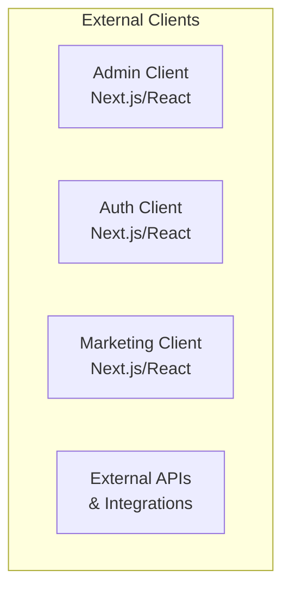

# 2. System Component Diagram

## Visual Architecture Overview

This document provides a comprehensive visual representation of the Yarns system architecture, showing how all components interact and communicate.

## System Architecture Diagram

```mermaid
graph TB
    %% External Clients Layer
    subgraph "External Clients"
        AC[Admin Client<br/>Next.js/React]
        AUC[Auth Client<br/>Next.js/React]
        MC[Marketing Client<br/>Next.js/React]
        EXT[External APIs<br/>& Integrations]
    end

    %% API Gateway Layer
    subgraph "API Gateway (Port 8000)"
        AG[API Gateway<br/>Next.js 14]
        AG-Auth[Authentication<br/>JWT/OAuth2]
        AG-Route[Request Routing<br/>& Load Balancing]
        AG-Rate[Rate Limiting<br/>& Throttling]
        AG-Mon[Monitoring<br/>& Tracing]
    end

    %% Event Streaming Layer
    subgraph "Event Streaming (Port 8001)"
        ES[Event Streaming Service<br/>Next.js 14]
        ES-API[HTTP Platform API<br/>Client Requests & Responses]
        ES-SSE[Server-Sent Events<br/>One-way Communication]
        ES-Redis[Redis Event Store<br/>Event Persistence]
        ES-Pub[Event Publisher<br/>Message Distribution]
    end

    %% Core Services Layer
    subgraph "Core Business Services"
        US[User Service<br/>Next.js/TypeScript]
        TS[Tenant Service<br/>Next.js/TypeScript]
        PS[Payment Service<br/>Next.js/TypeScript]
        EMS[Email Service<br/>Next.js/TypeScript + Rust]
        MS[Monitoring Service<br/>Next.js/TypeScript]
    end

    %% Shared Infrastructure
    subgraph "Shared Infrastructure"
        SI[Shared Infrastructure<br/>Package]
        EC[Environment Configuration<br/>Package]
        EBC[Event-Based Service Client<br/>Package]
        DB[(PostgreSQL<br/>Multi-tenant)]
        REDIS[(Redis<br/>Caching & Sessions)]
        KAFKA[(Kafka/Redis Streams<br/>Event Bus)]
    end

    %% External Services
    subgraph "External Services"
        SG[SendGrid<br/>Email Delivery]
        STRIPE[Stripe<br/>Payment Processing]
        SMS[SMS Providers<br/>Notifications]
        CDN[CDN Services<br/>Asset Delivery]
    end

    %% Connections
    AC --> AG
    AUC --> AG
    MC --> AG
    EXT --> AG

    AG --> AG-Auth
    AG --> AG-Route
    AG --> AG-Rate
    AG --> AG-Mon

    AG --> US
    AG --> TS
    AG --> PS
    AG --> EMS
    AG --> MS

    US --> DB
    TS --> DB
    PS --> DB
    EMS --> DB
    MS --> DB

    US --> REDIS
    TS --> REDIS
    PS --> REDIS
    EMS --> REDIS
    MS --> REDIS

    US --> KAFKA
    TS --> KAFKA
    PS --> KAFKA
    EMS --> KAFKA
    MS --> KAFKA

    EMS --> SG
    PS --> STRIPE
    EMS --> SMS

    ES --> ES-API
    ES --> ES-SSE
    ES --> ES-Redis
    ES --> ES-Pub

    ES --> KAFKA

    %% Client-to-Platform API (HTTP)
    AC -.->|HTTP| ES-API
    AUC -.->|HTTP| ES-API
    MC -.->|HTTP| ES-API

    %% Event flows
    US -.->|Events| ES
    TS -.->|Events| ES
    PS -.->|Events| ES
    EMS -.->|Events| ES
    MS -.->|Events| ES

    %% Service mesh connections
    US -.->|Service Mesh| TS
    US -.->|Service Mesh| PS
    US -.->|Service Mesh| EMS
    TS -.->|Service Mesh| PS
    TS -.->|Service Mesh| EMS
    PS -.->|Service Mesh| EMS

    style AG fill:#e1f5fe
    style ES fill:#f3e5f5
    style US fill:#e8f5e8
    style TS fill:#fff3e0
    style PS fill:#fce4ec
    style EMS fill:#f1f8e9
    style MS fill:#ede7f6
    style DB fill:#ffecb3
    style REDIS fill:#ffcdd2
    style KAFKA fill:#dcedc8
```



## Component Relationships

### External Clients → API Gateway
- **Admin Client**: Management dashboard, user administration, system monitoring
- **Auth Client**: User authentication, registration, password reset
- **Marketing Client**: Public website, content management, lead generation
- **External APIs**: Third-party integrations and webhook consumers

### API Gateway Functions
- **Authentication**: Validates JWT tokens, OAuth2 flows, API keys
- **Request Routing**: Directs requests to appropriate services based on URL patterns
- **Rate Limiting**: Enforces per-client and per-endpoint rate limits
- **Monitoring**: Collects metrics, traces requests, logs activities

### Services → Infrastructure
- **Database**: PostgreSQL with multi-tenant architecture
- **Redis**: Caching, sessions, event store for Event Streaming
- **Kafka/Redis Streams**: Event bus for asynchronous communication

### Services → External Providers
- **Email Service**: Integrates with SendGrid for email delivery
- **Payment Service**: Integrates with Stripe for payment processing
- **SMS/Notifications**: Various providers for multi-channel communication

## Data Flow Patterns

### Synchronous Request Flow
```
External Client → API Gateway → Service → Database → Response
```

### Asynchronous Event Flow
```
Service → Event Bus → Event Streaming → Other Services → External Updates
```

### Real-Time Update Flow
```
Service → Event Bus → Event Streaming → Platform API (HTTP) → Clients
```

## Network Architecture

### Port Allocation
| Component | Port | Protocol | Purpose |
|-----------|------|----------|---------|
| API Gateway | 8000 | HTTP/HTTPS | External API access |
| Event Streaming | 8001 | HTTP/WS | Real-time events |
| Admin Client | 3000 | HTTP | Admin dashboard |
| Auth Client | 3001 | HTTP | Authentication UI |
| Marketing Client | 3002 | HTTP | Public website |
| Email Service | 3003 | HTTP | Email processing |
| Monitoring Service | 3004 | HTTP | System monitoring |
| Payment Service | 3005 | HTTP | Payment processing |
| Tenant Service | 3006 | HTTP | Tenant management |
| User Service | 3007 | HTTP | User management |

### Network Zones
- **Public Zone**: API Gateway, Event Streaming (ports 8000-8001)
- **Service Zone**: Business services (ports 3000-3007)
- **Database Zone**: PostgreSQL, Redis (internal network)
- **External Zone**: Third-party APIs and services

## Deployment Architecture

### Containerization Strategy
- All services containerized with Docker
- Kubernetes orchestration for production
- Docker Compose for local development
- Vercel for client applications and core services

### Scalability Patterns
- **Horizontal Scaling**: Add more instances of stateless services
- **Database Scaling**: Read replicas and connection pooling
- **Event Streaming**: Partitioned event streams
- **CDN Integration**: Static asset delivery optimization

## Security Boundaries

### Authentication Perimeters
1. **Client → API Gateway**: JWT tokens, API keys
2. **API Gateway → Services**: mTLS certificates, service tokens
3. **Services → Database**: Database-specific credentials
4. **Services → External APIs**: API keys, OAuth2 tokens

### Network Security
- **VPC Isolation**: Services in private subnets
- **Security Groups**: Port-specific firewall rules
- **Load Balancers**: SSL termination and request distribution
- **WAF**: Web application firewall for API Gateway

## Component Interaction Matrix

| Component | Auth | User | Tenant | Payment | Email | Monitoring |
|-----------|------|------|--------|---------|-------|------------|
| **Admin Client** | ✓ | ✓ | ✓ | ✓ | ✓ | ✓ |
| **Auth Client** | ✓ | ✓ | ✗ | ✗ | ✓ | ✗ |
| **Marketing Client** | ✓ | ✓ | ✗ | ✓ | ✓ | ✗ |
| **User Service** | ✓ | N/A | ✓ | ✓ | ✓ | ✓ |
| **Tenant Service** | ✓ | ✓ | N/A | ✓ | ✓ | ✓ |
| **Payment Service** | ✓ | ✓ | ✓ | N/A | ✓ | ✓ |
| **Email Service** | ✓ | ✓ | ✓ | ✓ | N/A | ✓ |
| **Monitoring Service** | ✓ | ✓ | ✓ | ✓ | ✓ | N/A |

**Legend**: ✓ = Direct interaction, ✗ = No direct interaction, N/A = Self-interaction

## Infrastructure Dependencies

### Core Dependencies
- **PostgreSQL**: Primary data storage with multi-tenant support
- **Redis**: Caching, sessions, event store
- **Kafka/Redis Streams**: Event distribution and processing

### External Dependencies
- **SendGrid**: Email delivery infrastructure
- **Stripe**: Payment processing infrastructure
- **SMS Providers**: Multi-channel notification delivery
- **CDN Services**: Global asset distribution

## Monitoring and Observability Points

### Key Metrics Collection Points
1. **API Gateway**: Request count, latency, error rates
2. **Services**: Response times, database connections, error rates
3. **Event Streaming**: Event throughput, HTTP Platform API connections
4. **Database**: Query performance, connection pool health
5. **External APIs**: Response times, error rates, costs

### Health Check Endpoints
- `/health` - Basic service availability
- `/readiness` - Service readiness for traffic
- `/metrics` - Prometheus metrics export
- `/debug/vars` - Detailed runtime information

## Editable Source Files

The diagram above is generated from the following Mermaid source, which should be stored in version control:



Store the complete Mermaid source in `/docs/architecture/component-diagram.mmd` for easy editing and version control.
