# 4. Data Flow / Request Lifecycle

This document describes the end-to-end journey of key interactions through the Foment system, showing how requests flow between components and how data is processed across the architecture.

## Request Lifecycle Overview

### Synchronous Request Flow Pattern
```
External Request → API Gateway → Service → Database → Response
```

### Asynchronous Event Flow Pattern
```
Service Action → Event Publishing → Event Streaming → Event Consumption → Side Effects
```

### Real-Time Update Flow Pattern
```
Service Action → Event Publishing → Platform API (HTTP) → Client Updates
```

## Key User Journey Flows

### 1. User Registration and Authentication

#### Registration Flow
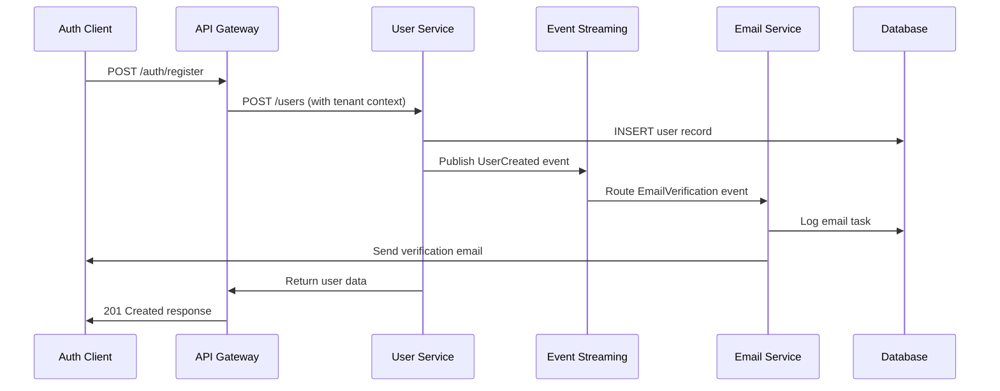

**Key Components**:
- **Auth Client**: Collects registration data and handles UI
- **API Gateway**: Validates request, adds tenant context
- **User Service**: Creates user with multi-tenant isolation
- **Event Streaming**: Coordinates verification email
- **Email Service**: Sends welcome/verification emails

**Data Transformations**:
- Registration form data → User record with tenant isolation
- User creation → Email verification event
- Event routing → Email delivery task

#### Authentication Flow
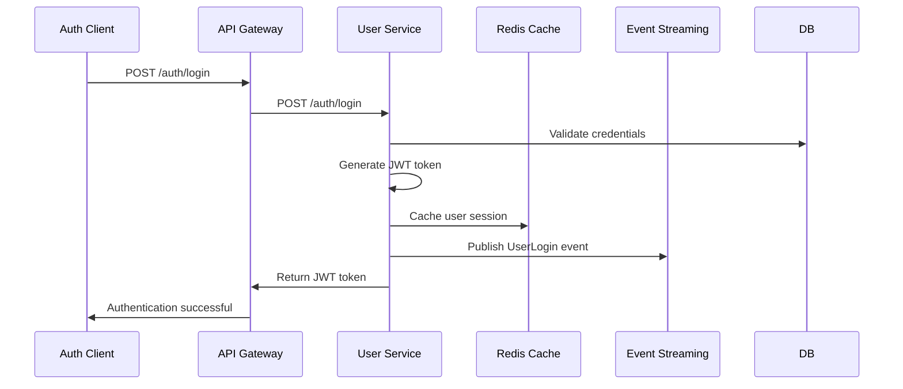

**Security Measures**:
- Password hashing with bcrypt
- JWT token generation with expiration
- Session caching in Redis
- Login event publishing for monitoring

### 2. Multi-Tenant Organization Setup

#### Tenant Creation Flow
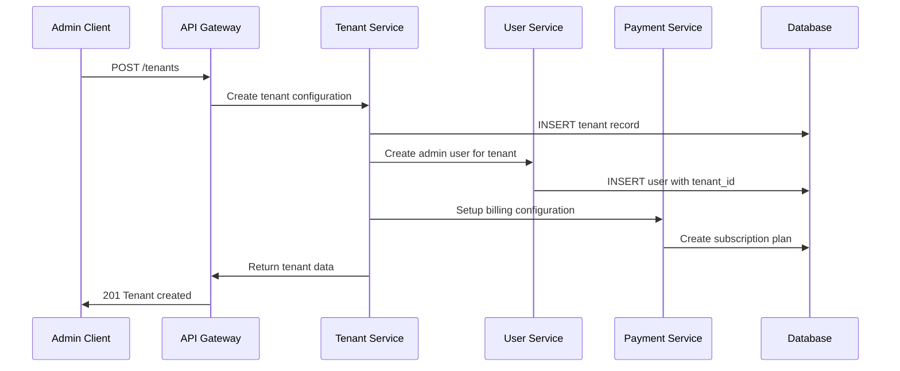

**Data Isolation**:
- Tenant record with unique identifier
- User record linked to specific tenant
- Billing configuration scoped to tenant
- Complete data separation at database level

### 3. Payment Processing

#### Subscription Payment Flow
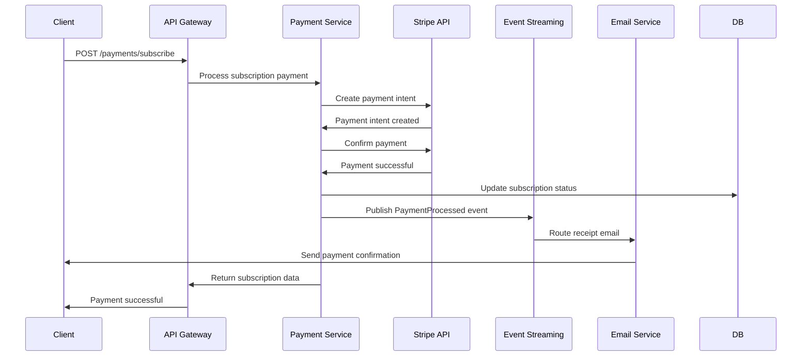

**Payment Security**:
- PCI-compliant payment processing
- Webhook verification for payment events
- Secure token handling
- Payment event publishing for audit trails

### 4. Real-Time Updates

#### HTTP Platform API and Updates
```mermaid
sequenceDiagram
    participant C as Client Browser
    participant API as Platform API (HTTP)
    participant ES as Event Streaming
    participant S as Business Service

    C->>API: POST /api/query or /api/command
    API->>ES: Publish to event stream
    ES->>S: Route to business service
    S->>ES: Publish response to stream
    ES->>API: Response available
    API->>C: HTTP response (JSON)

    Note over C,API: Request/response over HTTP; no persistent connection
```

**Real-Time Features**:
- HTTP request/response for commands and queries
- Event subscription management via API
- Client-side state synchronization

## Event-Driven Workflows

### Event Sourcing Pattern

#### User Profile Updates
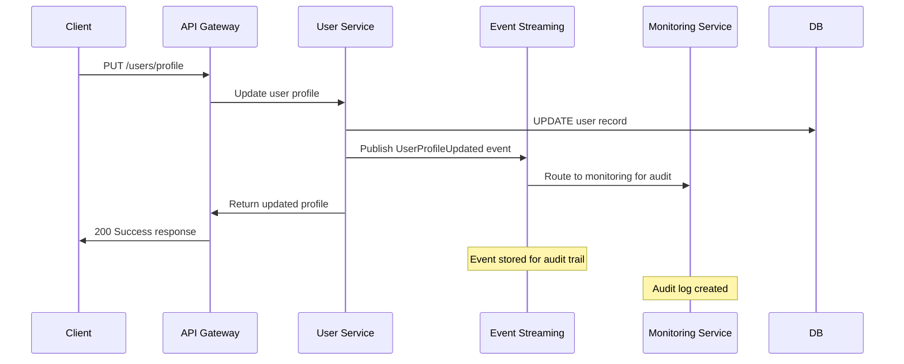

**Event Benefits**:
- Complete audit trail of all changes
- Event replay for debugging
- Decoupled event consumers
- Reliable event ordering

### CQRS Pattern Implementation

#### User Query vs Command Operations
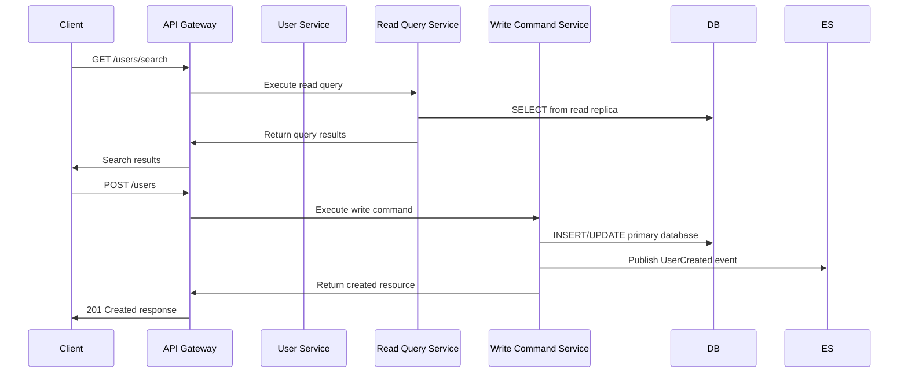

**CQRS Benefits**:
- Optimized read performance with replicas
- Independent scaling of read/write operations
- Event-driven consistency across read models
- Complex query optimization

### Saga Orchestration

#### Distributed Transaction Example (User + Payment)
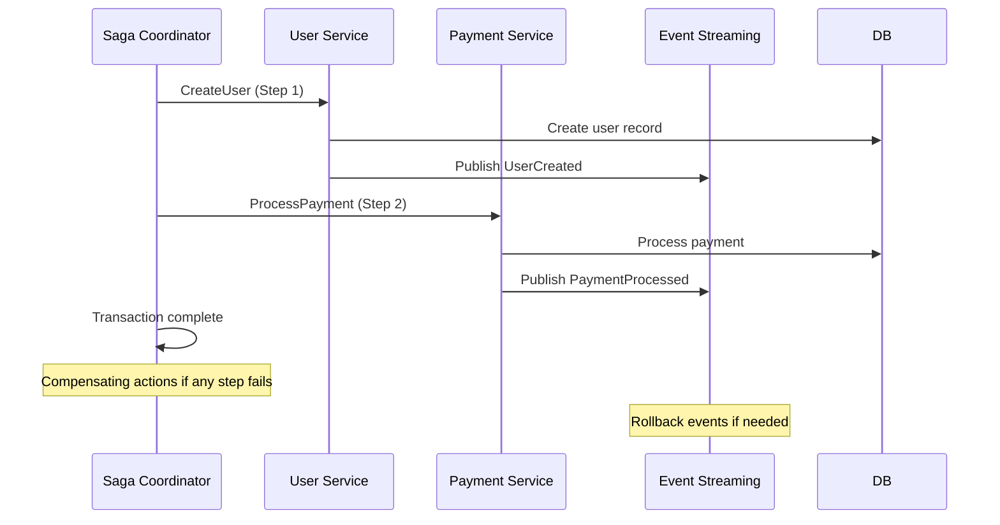

**Saga Features**:
- Distributed transaction coordination
- Automatic rollback on failures
- Event-driven compensation actions
- Cross-service consistency guarantees

## Background Processing Flows

### Email Delivery Pipeline
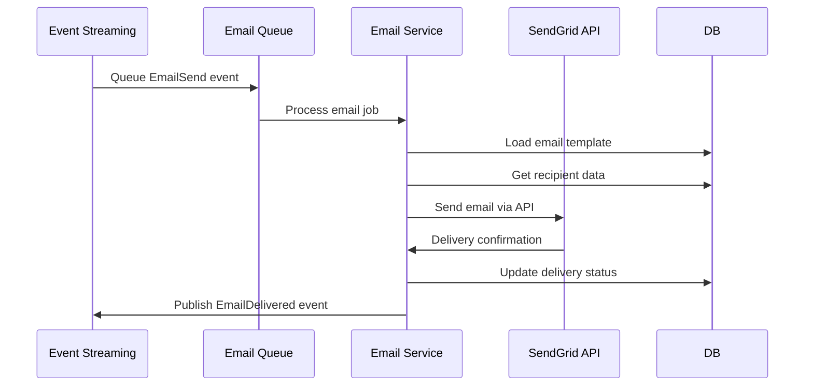

**Queue Processing**:
- Asynchronous email processing
- Retry logic with exponential backoff
- Dead letter queue for failed deliveries
- Delivery tracking and analytics

### Monitoring and Alerting Pipeline
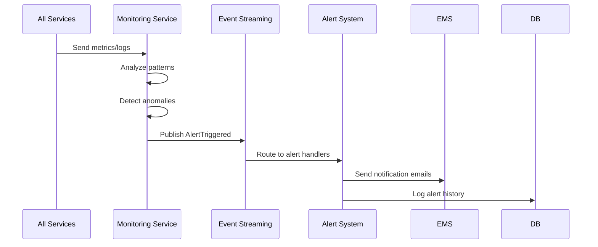

**Monitoring Flow**:
- Real-time metric collection
- Automated anomaly detection
- Alert routing and escalation
- Notification delivery coordination

## Data Consistency Patterns

### Eventual Consistency via Events
```
1. Service A updates data → Publishes ChangeEvent
2. Event Streaming routes event to interested services
3. Service B consumes event → Updates local read models
4. Service C consumes event → Triggers side effects
5. System reaches eventual consistency
```

### Strong Consistency via Distributed Transactions
```
1. Saga Coordinator starts transaction
2. Multiple services execute local transactions
3. Coordinator monitors completion
4. Success: Commit all changes
5. Failure: Execute compensating actions
```

## Performance Optimization Flows

### Caching Strategy
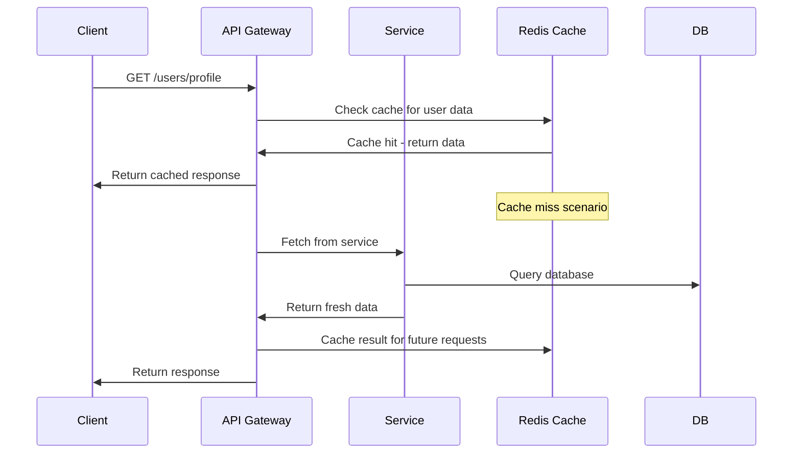

**Caching Benefits**:
- Reduced database load
- Improved response times
- Better user experience
- Configurable TTL per resource type

### CDN and Asset Delivery
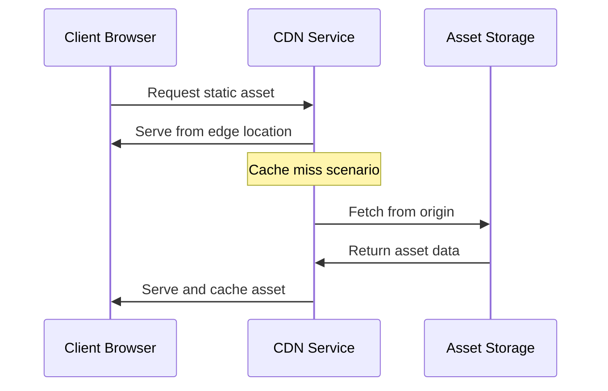

**CDN Benefits**:
- Global asset delivery optimization
- Reduced latency for static content
- Offloaded traffic from origin servers
- Improved scalability

## Error Handling and Resilience Patterns

### Circuit Breaker Pattern
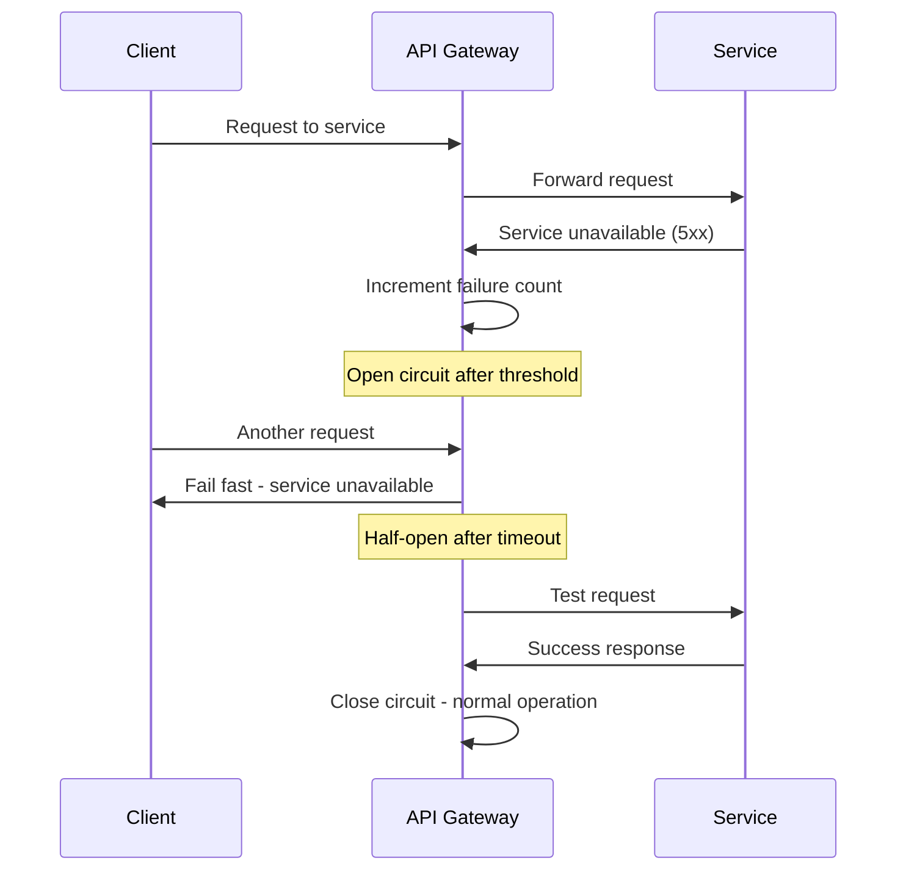

**Resilience Features**:
- Automatic failure detection
- Fast failure for unavailable services
- Gradual recovery testing
- Comprehensive error metrics

### Retry and Backoff Strategy
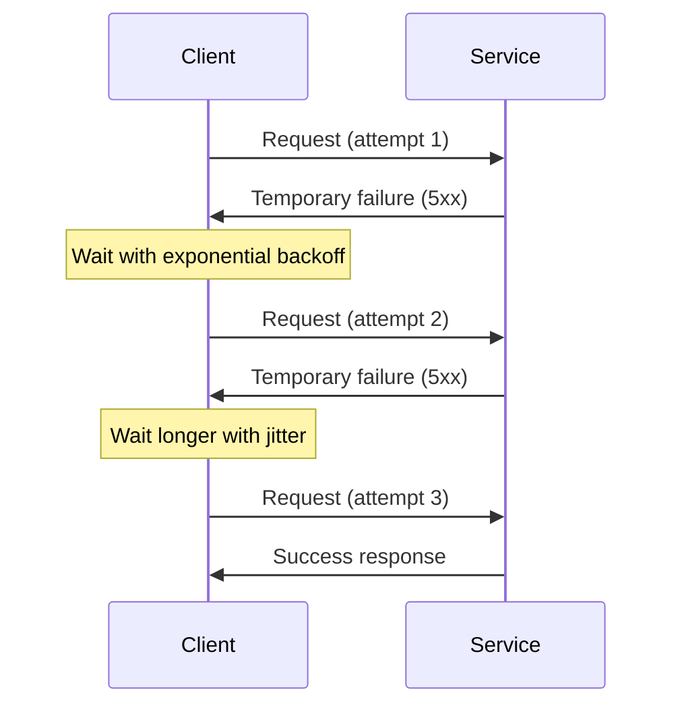

**Retry Benefits**:
- Handles transient failures
- Reduces error rates
- Improves system reliability
- Configurable retry policies

## Monitoring and Observability Data Flow

### Distributed Tracing
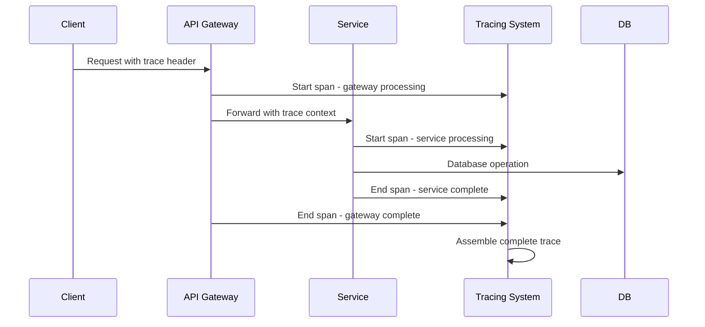

**Tracing Benefits**:
- End-to-end request visibility
- Performance bottleneck identification
- Service dependency mapping
- Error correlation across services

This comprehensive data flow documentation provides the foundation for understanding how data moves through the Foment system, enabling effective debugging, optimization, and maintenance of the platform.
