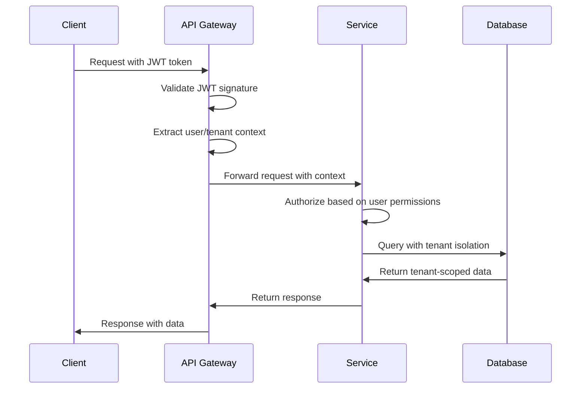

# 6. Service Communication & Integration

This document details how components interact with each other and the outside world, including protocols, API gateway patterns, messaging systems, and security boundaries.

## Communication Protocols

### HTTP/HTTPS (Primary Protocol)
**Usage**: Synchronous service-to-service communication and external API access
**Implementation**: RESTful APIs with JSON payloads

**Standards**:
- RESTful resource design (GET, POST, PUT, DELETE)
- JSON API specification for consistent responses
- HTTP status codes for error handling
- Content negotiation and versioning

**Security**:
- TLS 1.3 encryption for all communications
- API key authentication for service access
- JWT tokens for user authentication
- Request signing for webhook verification

### HTTP Platform API (Client–Platform Communication)
**Usage**: Client-to-platform communication for commands, queries, and event-driven responses
**Implementation**: HTTP POST to Platform API (`/api/query`, `/api/command`) with JSON payloads

**Key Features**:
- Request/response over HTTP; no long-lived connection required
- Same API shape for all clients (auth, admin, marketing)
- Timeout and retry handling
- Integrates with Redis Streams for backend routing

**Use Cases**:
- Auth flows (sign-in, sign-up, onboarding)
- Admin operations (user/tenant management)
- Marketing actions (contact form, newsletter, tracking)

### Message Queues (Asynchronous Communication)
**Usage**: Decoupled asynchronous processing and event-driven workflows
**Implementation**: Redis Streams for real-time, Kafka for high-throughput

**Patterns**:
- Publisher/Subscriber for event distribution
- Work queues for background job processing
- Dead letter queues for failed message handling
- Message retry with exponential backoff

## API Gateway Integration Patterns

### Request Routing and Load Balancing

#### Dynamic Routing
```typescript
// API Gateway routing logic
const routeRequest = (request: NextRequest) => {
  const { pathname } = request.nextUrl;

  // Service-specific routing
  if (pathname.startsWith('/api/users')) {
    return proxyToService('user-service', request);
  }

  if (pathname.startsWith('/api/payments')) {
    return proxyToService('payment-service', request);
  }

  // Default routing or 404
  return NextResponse.json({ error: 'Not found' }, { status: 404 });
};
```

**Routing Benefits**:
- Centralized request management
- Service abstraction from clients
- Dynamic service discovery
- A/B testing and canary deployments

#### Load Balancing Strategies
- **Round Robin**: Equal distribution across service instances
- **Least Connections**: Route to least busy instance
- **Weighted Distribution**: Custom weights for service capacity
- **Health-Based**: Route only to healthy instances

### Authentication and Authorization

#### Multi-Layer Authentication
1. **API Gateway Level**: JWT validation, API key verification
2. **Service Level**: Service-specific authorization checks
3. **Database Level**: Row-level security for tenant isolation

#### Authentication Flow


**Security Features**:
- Stateless JWT authentication
- Refresh token rotation for security
- API key management for service access
- Request rate limiting per user/tenant

### Rate Limiting and Throttling

#### Multi-Level Rate Limiting
- **Global Limits**: System-wide request throttling
- **Per-Tenant Limits**: Tenant-specific usage quotas
- **Per-User Limits**: Individual user request limits
- **Per-Endpoint Limits**: Specific endpoint restrictions

#### Implementation Strategy
```typescript
// Redis-based rate limiting
const rateLimit = async (key: string, limit: number, windowMs: number) => {
  const redisKey = `ratelimit:${key}`;
  const current = await redis.incr(redisKey);

  if (current === 1) {
    await redis.expire(redisKey, windowMs / 1000);
  }

  if (current > limit) {
    throw new RateLimitError('Too many requests');
  }
};
```

## Service Mesh Integration

### Service Discovery
**Implementation**: Dynamic service registration and health monitoring

**Discovery Mechanisms**:
- DNS-based service discovery
- Service registry with health checks
- Load balancer integration
- Circuit breaker pattern implementation

### Circuit Breaker Pattern

#### Implementation Strategy
```typescript
class CircuitBreaker {
  private failures = 0;
  private lastFailureTime = 0;
  private state: 'CLOSED' | 'OPEN' | 'HALF_OPEN' = 'CLOSED';

  async execute<T>(operation: () => Promise<T>): Promise<T> {
    if (this.state === 'OPEN') {
      if (Date.now() - this.lastFailureTime > 60000) { // 1 minute
        this.state = 'HALF_OPEN';
      } else {
        throw new Error('Circuit breaker is OPEN');
      }
    }

    try {
      const result = await operation();
      this.onSuccess();
      return result;
    } catch (error) {
      this.onFailure();
      throw error;
    }
  }

  private onSuccess() {
    this.failures = 0;
    this.state = 'CLOSED';
  }

  private onFailure() {
    this.failures++;
    this.lastFailureTime = Date.now();

    if (this.failures >= 5) { // Threshold
      this.state = 'OPEN';
    }
  }
}
```

**Benefits**:
- Prevents cascade failures
- Fast failure for unavailable services
- Automatic recovery testing
- Improved system resilience

### Traffic Management

#### A/B Testing and Canary Deployments
- Traffic splitting for feature testing
- Gradual rollout strategies
- Performance comparison capabilities
- Rollback mechanisms for failed deployments

#### Traffic Shaping
- Request prioritization by user type
- Resource allocation based on tenant tier
- Dynamic traffic routing based on load
- Geographic traffic distribution

## Event-Driven Integration

### Event Publishing and Consumption

#### Event Schema Definition
```typescript
interface BaseEvent {
  id: string;
  type: string;
  timestamp: Date;
  source: string;
  tenantId: string;
  userId?: string;
  correlationId: string;
}

interface UserCreatedEvent extends BaseEvent {
  type: 'user.created';
  data: {
    userId: string;
    email: string;
    tenantId: string;
    roles: string[];
  };
}
```

**Event Standards**:
- Structured event schemas with versioning
- Correlation IDs for request tracing
- Tenant isolation in all events
- Standardized timestamp formats

### Event Streaming Architecture

#### Publisher Pattern
```typescript
class EventPublisher {
  async publish(event: BaseEvent): Promise<void> {
    // Add metadata
    const enrichedEvent = {
      ...event,
      id: uuidv4(),
      timestamp: new Date(),
      source: this.serviceName,
    };

    // Publish to stream
    await this.redis.xadd(
      'events',
      '*',
      'event', JSON.stringify(enrichedEvent)
    );

    // Publish to monitoring
    await this.monitoring.recordEvent(enrichedEvent);
  }
}
```

#### Consumer Pattern
```typescript
class EventConsumer {
  async startConsuming(): Promise<void> {
    while (true) {
      const events = await this.redis.xreadgroup(
        'events',
        this.consumerGroup,
        '0',
        100
      );

      for (const event of events) {
        await this.processEvent(event);
      }
    }
  }

  private async processEvent(event: any): Promise<void> {
    try {
      // Validate event schema
      const validatedEvent = this.validateEvent(event);

      // Process based on event type
      await this.eventHandlers[validatedEvent.type]?.(validatedEvent);

      // Acknowledge successful processing
      await this.redis.xack('events', this.consumerGroup, event.id);
    } catch (error) {
      // Handle processing errors
      await this.handleError(event, error);
    }
  }
}
```

### Event Sourcing and CQRS

#### Event Sourcing Implementation
```typescript
class EventSourcedAggregate {
  private events: DomainEvent[] = [];
  private state: AggregateState;

  async applyEvent(event: DomainEvent): Promise<void> {
    // Apply event to state
    this.state = this.reducer(this.state, event);

    // Store event for audit trail
    this.events.push(event);
    await this.eventStore.save(event);
  }

  // Rebuild state from events
  static async fromEvents(events: DomainEvent[]): Promise<EventSourcedAggregate> {
    const aggregate = new EventSourcedAggregate();
    for (const event of events) {
      await aggregate.applyEvent(event);
    }
    return aggregate;
  }
}
```

**CQRS Benefits**:
- Optimized read and write operations
- Event-driven consistency across read models
- Scalable query processing
- Audit trail for compliance

## External API Integrations

### Third-Party Service Integration

#### Payment Provider Integration (Stripe)
```typescript
class StripeIntegration {
  async createPaymentIntent(amount: number, currency: string): Promise<string> {
    const paymentIntent = await this.stripe.paymentIntents.create({
      amount: amount * 100, // Convert to cents
      currency,
      metadata: {
        tenantId: this.tenantId,
        userId: this.userId,
      },
    });

    return paymentIntent.client_secret;
  }

  async handleWebhook(event: Stripe.Event): Promise<void> {
    switch (event.type) {
      case 'payment_intent.succeeded':
        await this.processSuccessfulPayment(event.data.object);
        break;
      case 'payment_intent.payment_failed':
        await this.processFailedPayment(event.data.object);
        break;
    }
  }
}
```

**Integration Patterns**:
- Webhook verification for security
- Idempotent event processing
- Retry logic for transient failures
- Comprehensive error handling

#### Email Provider Integration (SendGrid)
```typescript
class SendGridIntegration {
  async sendEmail(templateId: string, to: string, data: any): Promise<void> {
    const email = {
      to,
      from: this.fromEmail,
      templateId,
      dynamicTemplateData: data,
      trackingSettings: {
        clickTracking: { enable: true },
        openTracking: { enable: true },
      },
    };

    await this.sendgrid.send(email);
  }

  async getEmailAnalytics(emailId: string): Promise<EmailAnalytics> {
    const [response] = await this.sendgrid.request({
      url: `/v3/messages/${emailId}`,
      method: 'GET',
    });

    return this.parseAnalytics(response.body);
  }
}
```

**Email Features**:
- Template-based email generation
- Delivery tracking and analytics
- Bounce handling and suppression
- A/B testing capabilities

### Webhook Integration

#### Incoming Webhook Handling
```typescript
class WebhookHandler {
  async handleWebhook(payload: any, signature: string): Promise<void> {
    // Verify webhook signature
    if (!this.verifySignature(payload, signature)) {
      throw new Error('Invalid webhook signature');
    }

    // Process based on event type
    const eventType = payload.type;
    await this.webhookHandlers[eventType]?.(payload.data);

    // Publish to internal event system
    await this.eventPublisher.publish({
      type: 'webhook.received',
      source: 'external',
      data: payload,
    });
  }
}
```

**Webhook Security**:
- Signature verification for authenticity
- Duplicate event detection and handling
- Rate limiting for webhook endpoints
- Comprehensive logging for debugging

## Security Communication Patterns

### Inter-Service Authentication

#### mTLS (Mutual TLS)
**Usage**: Secure service-to-service communication
**Implementation**: Certificate-based authentication

**Certificate Management**:
- Automated certificate provisioning
- Certificate rotation and renewal
- Service identity verification
- Encrypted communication channels

#### Service Tokens
**Usage**: Lightweight service authentication
**Implementation**: Shared secret or public key tokens

**Token Usage**:
- Service-to-service API authentication
- Temporary access tokens with expiration
- Scoped permissions per service
- Token revocation capabilities

### API Security

#### API Gateway Security
- JWT token validation and renewal
- API key management and rotation
- Request signature verification
- CORS configuration for browser clients

#### Service-Level Security
- Input validation and sanitization
- SQL injection prevention
- XSS protection measures
- Rate limiting per service

## Monitoring and Observability

### Distributed Tracing
**Implementation**: OpenTelemetry for trace collection and propagation

**Tracing Flow**:
1. Request enters API Gateway with trace context
2. Context propagated to downstream services
3. Spans collected for performance analysis
4. Traces correlated for end-to-end visibility

### Metrics Collection
**Implementation**: Prometheus metrics with custom business metrics

**Key Metrics**:
- Request latency and throughput
- Error rates and failure modes
- Resource utilization (CPU, memory, disk)
- Business-specific KPIs (users, payments, emails)

### Logging Strategy
**Implementation**: Structured logging with correlation IDs

**Log Levels**:
- ERROR: System failures and exceptions
- WARN: Deprecated features and potential issues
- INFO: Important business events
- DEBUG: Detailed debugging information

## Integration Testing Patterns

### Service Integration Testing
```typescript
describe('Service Integration', () => {
  it('should handle complete user registration flow', async () => {
    // Test API Gateway routing
    const response = await request(app)
      .post('/api/users')
      .send(userData);

    // Test service interaction
    expect(response.status).toBe(201);

    // Test event publishing
    await expectEventPublished('user.created');

    // Test email sending
    await expectEmailSent('welcome-email');
  });
});
```

**Testing Benefits**:
- End-to-end workflow validation
- Event-driven interaction testing
- External service integration verification
- Performance and reliability testing

This comprehensive communication and integration framework ensures reliable, secure, and scalable interactions between all components in the Yarns ecosystem.
